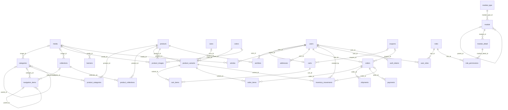

# Entity Relationship Diagram

Relationships from V9. Optionality is shown for nullable foreign keys; carts have a unique user ID.

```mermaid
erDiagram
    categories o|--o{ categories : parent_id
    media o|--o{ categories : image_id
    media o|--o{ collections : image_id
    navigation_items o|--o{ navigation_items : parent_id
    categories o|--o{ navigation_items : category_id
    collections o|--o{ navigation_items : collection_id
    products ||--o{ product_categories : product_id
    categories ||--o{ product_categories : category_id
    products ||--o{ product_collections : product_id
    collections ||--o{ product_collections : collection_id
    products ||--o{ product_variants : product_id
    sizes o|--o{ product_variants : size_id
    colors ||--o{ product_variants : color_id
    products ||--o{ product_images : product_id
    media ||--o{ product_images : media_id
    colors o|--o{ product_images : color_id
    users ||--o| carts : user_id
    coupons o|--o{ carts : coupon_id
    carts ||--o{ cart_items : cart_id
    product_variants ||--o{ cart_items : variant_id
    users ||--o{ wishlists : user_id
    products ||--o{ wishlists : product_id
    media ||--o{ banners : media_id
    media o|--o{ articles : media_id
    users o|--o{ articles : author_id
    users ||--o{ addresses : user_id
    users ||--o{ orders : user_id
    coupons o|--o{ orders : coupon_id
    orders ||--o{ order_items : order_id
    product_variants ||--o{ order_items : variant_id
    orders ||--o{ shipments : order_id
    orders ||--o{ payments : order_id
    product_variants ||--o{ inventory_movements : variant_id
    orders o|--o{ inventory_movements : order_id
    users o|--o{ inventory_movements : created_by
    users ||--o{ user_roles : user_id
    roles ||--o{ user_roles : role_id
    module_type ||--o{ module : module_type_id
    module o|--o{ module : parent_id
    module ||--o{ module_detail : module_id
    roles ||--o{ role_permissions : role_id
    module_detail ||--o{ role_permissions : module_detail_id
    users ||--o{ auth_tokens : user_id
```
